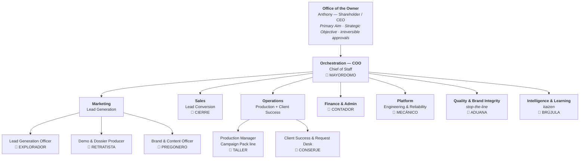

# AMMA Ventures — Organizational Strategy (E-Myth)

_Created 2026-08-17. Applies Michael Gerber's E-Myth organizational method to
AMMA Ventures LLC (DBA Fina Calle). Companion files: `02_POSITION_CONTRACTS.md`,
`03_AI_STAFF.md`, `04_AUTOMATION_ROLLOUT.md`._

Evidence labels used throughout: **verified** (supported by this repo, a connected
account, or a measured result), **inference** (plausible, needs a controlled test),
**unknown** (evidence unavailable — never converted to zero or to a claim).
This follows `OPERATIONS/AMMA_OPTIMIZATION_REGISTER.md` and `AI_HONESTY_PROTOCOL.md`.

---

## 0. Why this document exists

`BUSINESS/AMMA_VENTURES_BUSINESS_PLAN.md` already names the correct thesis — the
**Managerial Factory** — and already names the correct risk:

> "**Founder is the single point of failure** — designer + closer + QC all in one.
> The factory thesis collapses if you get sucked into line labor."

and the correct KPI:

> "**hours of founder bespoke labor (drive toward zero)**"

What the plan does not yet have is the E-Myth structure that makes that KPI
actionable: **an organizational chart of positions, a Position Contract per
position, and a named system holding each position instead of a person.**
That is what this file supplies.

### The E-Myth move, in one paragraph

Gerber's argument: most small businesses are not businesses, they are *jobs owned
by the person doing them*. The fix is to organize the company **around positions,
not around people** — draw the org chart for the business you intend to *have*,
write a Position Contract for every box, then sign your own name into every box
you currently fill. That chart is the honest picture of the problem. The work
after that is a single repeating move: **replace your name in one box with a
system that produces the same result.** In a 2026 AI company, "a system" means a
documented process + a scheduled agent + a ledger + a verification gate.

### One caution, stated once, then built around

"AI works without me" has a hard floor, and it is not a technology limit — it is
in your own governing documents. `CLAUDE.md` reserves secrets, access grants,
sends/publishes, and production merges to you. `AI_HONESTY_PROTOCOL.md` forbids
any agent from inventing a fact to fill a gap. The Optimization Register forbids
converting an unknown into a result. So the goal is not zero owner input; the
goal is a **bounded, batched, predictable owner input budget** — a known number
of decisions per day, each one answerable in a word, each one genuinely yours to
make. The design below drives toward that, and states the floor explicitly in
§5. Everything else gets automated.

---

## 1. The Primary Aim (owner — one line, yours to set)

E-Myth requires the personal aim *before* the business objective, because the
business is a means to it. This cannot be inferred for you, and inventing one
would violate the honesty protocol.

**PROPOSED (inference — confirm or replace with one line):**

> _"AMMA exists so that Anthony owns a Hampton Roads business that produces
> income and local standing without consuming his days — the founder designs and
> tunes the factory, and does not work the line."_

Evidence for the proposal: the business plan's own stated KPI (founder bespoke
labor → zero) and its stated risk #1. **Owner action: confirm, or replace the
sentence.** Everything downstream inherits from it.

## 2. The Strategic Objective (the business, measurable)

E-Myth: the Strategic Objective is the standard the business must meet — how big,
by when, at what quality — so that every position can be judged against it.

**Verified anchors (do not restate as targets):**

| Anchor | State | Label |
|---|---|---|
| First live client — Colattao | Live; case study published at `/case-studies/colattao` | verified |
| Colattao first 30-day production window | 2,874 visitors · 4,599 page views (owner-verified) | verified |
| Colattao plan | $149/month documented; **paid Checkout completion** | verified / **unknown** |
| Prospects in owner-review demo | Las Palmas (Lynnhaven), AJ Gator's (Holland Road) — live, `noindex`, client approval pending | verified |
| Price band researched | $59–149/mo vs. Toast-tier $185–379/mo all-in | verified |
| Local density | ~350 independent restaurants in Virginia Beach; Hampton Roads multiplies it | verified |
| MRR, churn, CAC, demo→close rate | no dataset exists | **unknown** |

**PROPOSED Strategic Objective (inference — one-word confirm or edit the numbers):**

> By **2027-08-01**, Fina Calle serves **20 paying independent restaurant clients**
> in Hampton Roads at a blended **$149/mo + setup**, delivered to the standard that
> **a new signed client reaches a verified live portal in ≤5 business days** with
> **zero founder bespoke production labor**, and every client has **per-client
> engagement proof** (scans, plays, redemptions) visible in their own dashboard.
> The founder's total operating input is **≤45 minutes per weekday**.

Why these four clauses: they are, in order, the revenue standard, the delivery
standard, the factory standard (the thing that makes it a business and not a job),
and the ROI standard the plan itself calls "the most important missing piece."
The 45-minute clause is the one this whole document is engineered to deliver.

---

## 3. The Organizational Chart

Built for the business at the Strategic Objective — **not** for today's headcount.
Ten operating boxes plus the Office of the Owner.

### 3.1 The honest "today" chart (the diagnosis)

E-Myth insists you first sign your own name into every box you actually fill.
Doing that with current evidence:

| Box | Held today by | Label |
|---|---|---|
| Office of the Owner | **Anthony** | verified |
| Orchestration / COO | **Anthony** (assisted by Claude per session, no standing mandate) | verified |
| Lead Generation | **Anthony** | verified |
| Demo & Dossier | Claude/Codex on Anthony's per-request prompt → **Anthony triggers every run** | verified |
| Brand & Content | **Anthony** | verified |
| Sales Conversion | **Anthony** — the loop doc states "the owner does all outreach, calls, and closing" | verified |
| Production | Claude/Codex, **Anthony-triggered**, Anthony approves each merge | verified |
| Client Success | **Anthony** | verified |
| Finance & Admin | **Anthony** | verified |
| Platform / Reliability | ⚠ R3 — **active, maturity unproven.** The caretaker runs twice daily on the `automation/status` branch: 344 commits, 96 status check-ins, 2026-05-31 → 2026-08-17, latest `faa42b6`. It recovered a corrupted dashboard on 08-17 unaided. Run-completion and silent-failure rates are unmeasured | active (verified) / maturity **unknown** |
| Quality & Brand Integrity | **Anthony** as final eye; gates exist in code (lint, tsc, build, phone QA, logo rules) | verified |
| Intelligence & Learning | **nobody** — the outcome log has **zero verified samples** | verified |

**Diagnosis:** Anthony's name is in 11 of 12 boxes. One box (Intelligence) is
empty, which is why MRR, churn, CAC and demo→close are all *unknown* — nobody
holds the position that would know.

⚠ **R3 correction (supersedes R2):** Revision 2 claimed this box was "dark" and
the count "zero of twelve." **That was false**, produced by searching `main` in a
clone holding 2 of 138 remote heads — the caretaker's telemetry lives on
`automation/status`. The count stands at **1 of 12**, with the label sharpened:
Platform is **active, maturity unproven**. See `05` §0–§1.

**That is the whole problem, and it is now visible and finite.** The rest of this
document is the box-by-box replacement plan.

---

## 4. The departments and what each one owns

Each department maps to a station in the existing flywheel
(Acquire → Build → Activate → Monetize → Expand) and to one of the four Anthony
roles already defined in the Optimization Register (CEO/Strategist, Revenue
Producer, Delivery Owner, Finance/Admin). Nothing here invents a new operating
vocabulary; it staffs the one you already run.

| # | Department | Flywheel station | Owner role it relieves | Result it is accountable for |
|---|---|---|---|---|
| 0 | Office of the Owner | — | CEO/Strategist | The Primary Aim is served and irreversible decisions are made deliberately |
| 1 | Orchestration (COO) | all | CEO/Strategist | The factory runs one shift per day without being started by hand |
| 2 | Marketing / Lead Gen | Acquire | Revenue Producer | A standing queue of qualified, dossiered, demo-ready prospects |
| 3 | Sales / Conversion | Acquire | Revenue Producer | Qualified exposure → **dated next action** → proposal → signature-ready packet |
| 4 | Production | Build | Delivery Owner | Campaign Pack assembled to spec, gated, merge-ready |
| 5 | Client Success | Activate | Delivery Owner | Every owner request has a timestamped lifecycle; every client sees their own proof |
| 6 | Finance & Admin | Monetize | Finance/Admin | Cash is verified, never guessed; exceptions age visibly |
| 7 | Platform | all | Delivery Owner | Production stays up, green, patched, and reversible |
| 8 | Quality & Brand Integrity | all (jidoka) | CEO/Strategist | Nothing reaches a customer that fails brand, honesty, or guardrail inspection |
| 9 | Intelligence & Learning | Expand | CEO/Strategist | Every unknown in this document becomes a measured number |

Department 9 is the highest-leverage new box, because it is the one that turns the
"unknown" rows in §2 into a dataset. Until it exists, the company cannot tell
which of the other eight departments is actually the constraint.

---

## 5. The owner input floor (what can never be automated)

These stay with Anthony permanently. They come from `CLAUDE.md`,
`AI_HONESTY_PROTOCOL.md`, and the Optimization Register's approval gates — not
from caution about AI capability.

| # | Reserved to Anthony | Why it cannot move |
|---|---|---|
| 1 | The Primary Aim and the Strategic Objective | It is his life, not a process |
| 2 | Entering secrets and rotating credentials | Governing guardrail; no agent handles secrets |
| 3 | Granting or revoking human access | Irreversible, security-bearing |
| 4 | Authorizing money in or out (charges, refunds, spend) | Irreversible and legally his |
| 5 | Signing contracts and committing to price | Legal capacity is the owner's |
| 6 | First human contact with a prospect and the relationship itself | The moat is local relationships; also the loop doc reserves it |
| 7 | Merging to `main` / publishing to production | Irreversible customer-facing state |
| 8 | Approving a claim about a customer's results | Honesty protocol — an unverified claim is never generated |

**Everything not on this list is a candidate for automation.** The design target is
that these eight arrive as **batched, pre-packaged, one-word decisions** rather
than as work. See `04_AUTOMATION_ROLLOUT.md` §3, "The Owner Input Budget."

---

## 6. How to read the next files

1. `02_POSITION_CONTRACTS.md` — the E-Myth Position Contract for each box:
   result statement, accountabilities, standards, KPI, and an **automation grade
   (A1–A4)** on every line so it is unambiguous what the agent does alone.
2. `03_AI_STAFF.md` — the AI personality that holds each position: mandate,
   inputs, tools, outputs, refusal rules, escalation.
3. `04_AUTOMATION_ROLLOUT.md` — the runtime: schedules, ledgers, the daily
   digest, the phased build order, and the verified capability gaps.
