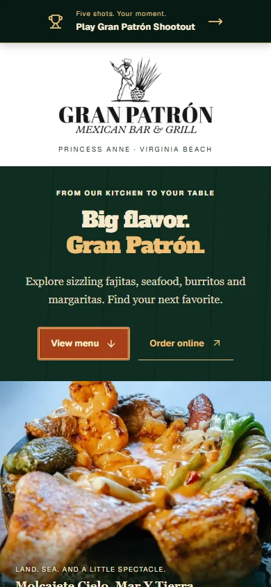
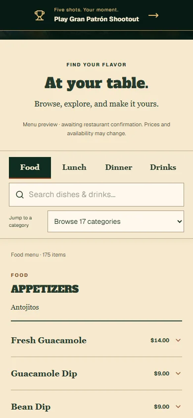
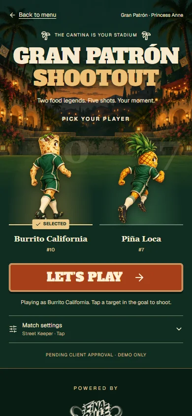
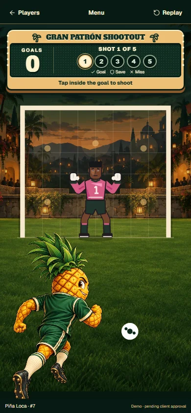

# Gran Patrón Princess Anne — implementation review

Anthony authorized this build with **Execute**, following GRAN_PATRON_BUILD_SPEC_20260916.md. Branch: `codex/gran-patron-menu-game`, based on production `306fcf4`. Production merge remains separately gated.

## Review the experience

- Menu: `/demo/gran-patron`
- Game: `/play/gran-patron`
- Local production-mode preview: http://localhost:3159/demo/gran-patron and http://localhost:3159/play/gran-patron
- Correct restaurant: **5168 Princess Anne Rd, Ste 145, Virginia Beach**.

| Menu landing | Browse the menu |
| --- | --- |
|  |  |

| Choose a player | Play the shootout |
| --- | --- |
|  |  |

## Delivered

- Las Palmas-inspired pine/parchment/rust/gold presentation, Alfa Slab One display type, original Gran Patrón logo and menu-linked molcajete hero.
- Food, Lunch, Dinner and Drinks navigation; full-catalog, accent-insensitive search; category jumps; native expandable rows and keyboard focus; source-linked external ordering.
- **338 entries across 30 categories**, reconciled against 339 direct source rows. The remaining row contains filling instructions, now a section note. Global menu notes, lunch hours, source dietary caution and beer notes are preserved. Notes are not counted as products.
- Shared section prices and every draft size preserved. Description-based portions remain explicit; unspecified spirit prices display “Ask for price.” Repeated names retain separate source IDs and menu context.
- Original Burrito California and Piña Loca soccer concepts, a Gran-specific cantina pitch, two-player selection, three difficulty levels, tap/swipe, five-shot rounds, scoreboard, replay and menu return.
- A typed optional presentation configuration supplies only brand copy, links and assets. Las Palmas retains its defaults. Phaser remains lazy-loaded after Play; engine, input, scoring and keeper rules have no diff.
- Fixed a verified shared recovery defect: failed dynamic imports can cache rejection. The failure screen now offers **Reload game** for a fresh download. The 30-second loading watchdog retains its existing retry.

## Sources and provenance

Direct browser snapshots from [food](https://granpatronvb.com/food-menu) and [drinks](https://granpatronvb.com/drink-menu), September 16, 2026, are committed beside the normalized catalog in `APP/web/src/table-os/menu/gran-patron/`. The [verified ordering provider](https://granpatron.hrpos.heartland.us/menu) is linked externally; no ordering workflow was submitted.

All 14 food photos and the original 600×315 logo were retrieved from URLs linked by the official site. Reviewed derivatives live in `APP/web/public/assets/granpatron/`; the manifest retains the source associations. Original food downloads remain in the local evidence folder. Photo availability and public visibility are not a claim of restaurant approval.

New game art used built-in `image_gen`; exact prompts and processing notes are in GRAN_PATRON_ART_PROMPTS_20260916.json. Transparent requests produced opaque backgrounds, so the selected generated magenta masters were normalized to real alpha WebP sprites. Both 640×960 sprites passed alpha/edge checks and were visually inspected in the game. Selected sources remain in the generator's output folder; production derivatives are committed in `public/assets/granpatron/game/`.

## Verification

- Production Next 16.2.11 build and TypeScript: pass, refreshed after the recovery fix.
- Targeted ESLint: pass for all touched application and preparation/test code.
- **135 self-test checks:** 95 Las Palmas menu, 19 lobby, 11 scoreboard, 10 Gran reconciliation/config/alpha. All passed.
- **50 primary browser checks:** 320/390/430/1440 menu and lobby layouts, correct tab totals, cross-menu and accent search, empty/reset states, all four draft sizes, keyboard expansion, category focus below sticky navigation, correct ordering URL, both complete five-shot rounds and replay, Club/Pro swipe, resize, missing-art play and Las Palmas real-shot regression. Zero uncaught page errors.
- **11 supplemental recovery checks passed:** hard download failure/reload for both clients, slow loading/watchdog/retry, remaining Burrito difficulty cases, and held-route behavior. Results are recorded in the handoff log.
- Touched UI audited against the current Vercel Web Interface Guidelines; source-aware prices remain literal instead of being numerically reinterpreted. Browse state currently resets on a full page reload; no filter deep-link contract is claimed.

Full local evidence: `C:/Dev/amma/evidence/gran-patron-build-20260916/production-qa`. Browser scripts use the installed Playwright runtime, not a new app dependency. They take a base URL and evidence directory; set `PLAYWRIGHT_MODULE_PATH` when using the bundled runtime.

## Release boundary

This is a **restaurant review preview** with noindex metadata and visible confirmation notices. Restaurant menu/art approval and Anthony's production merge approval remain outstanding. Mobile viewport/browser verification is complete; a physical iPhone/Android field test has not been performed.

No database, migration, access grant, billing action, owner integration, client send, QR replacement, original restaurant domain change or production merge is included. Held `/m` and `/owner-preview` source files have no diff. Without local Supabase configuration, `/m/las-palmas` returns the existing 200 “This menu isn't connected yet” holding page; this is not a connected menu or a production 404 assertion.
