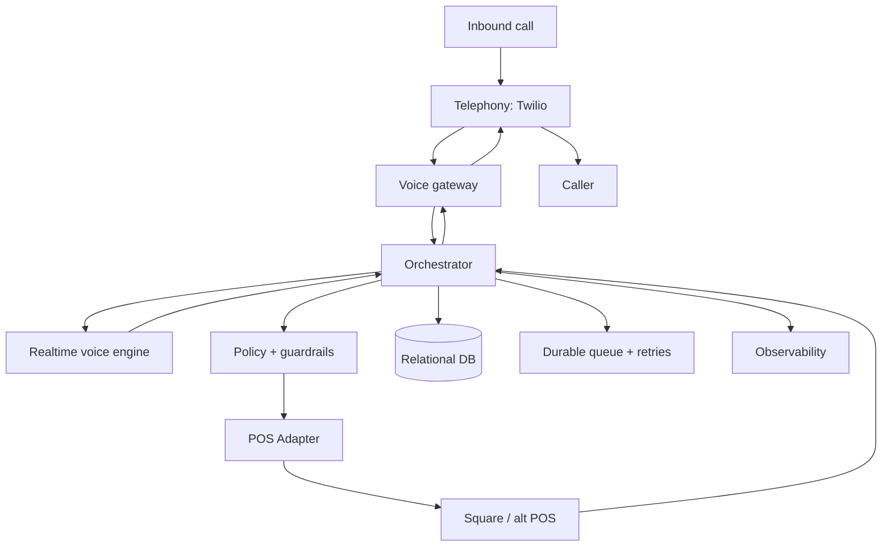

# AI Phone Assistant & AI Front-Desk / Booking Bots — plan + best-quality setup (v2)

> **Status: BUILT (v0.11) — pilotable, awaiting live keys.** The own-gateway design
> below is implemented in `services/voice-gateway/` and verified end-to-end by a keyless
> 43-check simulator (`npm run simulate`). Shipped: multi-tenant routing (one gateway,
> many businesses, by dialled number), draft-first **idempotent** booking, 5 connectors
> (mock / Cal.com / Square / generic webhook bridge / universal propose-confirm),
> per-tenant business-hours awareness, take-a-message + missed-call alerts, end-of-call
> summaries, per-tenant ROI at `/stats`, caller-number capture, `/tenants` ops view,
> durable atomic snapshot + a Postgres scale-out schema (`db/schema.sql`), and deploy
> packaging (`Dockerfile` + `render.yaml`). See `services/voice-gateway/README.md`.
>
> **What still needs external accounts (can't be verified in-repo):** a live
> `OPENAI_API_KEY` (Realtime — re-verify event names/audio formats against current docs),
> a Twilio number + `PUBLIC_HOST` (wss), and—per connector—Cal.com / Square / a
> Zapier-Make bridge; Postgres if scaling past one instance. Two-party-consent + AI
> disclosure stay on; inbound-only (outbound is TCPA-gated); no card-by-voice. Vendor
> specifics below should still be **re-verified against current docs before go-live**.

Two products on one engine:
1. **AMMA's own AI phone assistant** (internal) — answers AMMA's line, qualifies, books demos.
2. **AI Front-Desk + Booking Agent for clients** (sellable Fina Calle OS module) — a
   24/7 AI that answers the phone **and books real appointments into the business's own
   scheduling / POS system**, hands off to a human when risk rises. Works across
   appointment businesses — restaurants (reservations/orders), **pet groomers**,
   salons/barbers/spas, auto, clinics. Per-client variables = a **Knowledge Pack** +
   a **booking/POS connector**. Same Managerial-Factory model (frozen engine, swappable parts).

## The core principle: draft-first, reversible, auditable
**The architecture decision that matters is not "which voice sounds most human" — it's
"which design minimizes irreversible errors."** So: the AI converses, explains the
menu/services, **validates price/availability against the POS**, assembles an
**auditable draft**, and only then **commits** per policy. The real transaction lives
in the **draft**, not the call. High-risk actions (payments, loyalty redemption,
refunds, complex substitutions) require human approval until the system has proven, in
production, that it (a) understands the catalog, (b) validates against the POS, and
(c) never duplicates actions (idempotency).

## Why it sells (ROI)
~43% of restaurant calls go unanswered → AI answering shows ~87% fewer missed calls
and **$3k–18k/mo recovered per location**; ~34% of restaurants already use AI for
guest comms. Pet grooming/salons have hungry incumbents — proof the niche pays.

## Best-quality setup — the voice layer (reconciled)
**Latency bar:** under ~700ms feels conversational; best stacks hit **~550–620ms**.
The adapter + draft-first core (below) is identical regardless of voice layer, so the
voice layer is **swappable** — pick by phase:

- **Target — own gateway (control / auditability / portability / margin):**
  **Twilio Programmable Voice + bidirectional Media Streams** (`<Connect><Stream>`) →
  your **gateway** → **OpenAI Realtime over WebSocket** (the recommended mode when your
  server already receives raw audio; **SIP** also supported), with **tool/function
  calling** + interruption/turn control (`response.cancel`, `conversation.item.truncate`,
  `semantic_vad`). You own barge-in, retries, logging, routing, and can swap the model later.
- **Fast-start — managed platform (only if speed-to-first-client wins):** Retell AI
  (~620ms, SOC2/HIPAA) or ElevenLabs Conversational AI (best voice) or Vapi (BYO
  providers). They still call **our adapter** via custom tools, so nothing is lost in a later swap.
- **Keep the orchestrator a thin seam** so the LLM/voice is replaceable (portability).

| Component | First choice | Strong alternative | Switch when |
|---|---|---|---|
| Telephony | **Twilio** (Media Streams; ~$0.0085/min inbound local) | **SignalWire** (stream ~$0.003/min) / **Vonage** (Voice API + WebSockets) | SignalWire if per-minute cost dominates; Vonage if already in their stack |
| Voice engine | **OpenAI Realtime** (WebRTC/WS/SIP + tools + semantic_vad) | **Azure OpenAI Realtime / Voice Live** | Azure if compliance/procurement is Azure-aligned |
| Initial POS | **Square** | **Toast** | Toast if pure-restaurant **and** you already hold partner/custom-integration access; avoid **Clover** as the payments starter |
| STT/TTS fallback | **Built-in to the runtime** | Deepgram / ElevenLabs / Google / Azure Speech | Only when real metrics justify cost/naturalness gains |

## Architecture — five planes (keep them separated)
Telephony must not hold business logic; the AI must not write directly to the POS; the
adapter must not "speak" audio. That partition is what enables control + auditability + swap.

## The POS / booking adapter (the asset AMMA owns)
One **unified adapter contract** for every POS/booking system; the voice engine only
tool-calls it. Idempotency + error policy are first-class:

| Operation | Semantics | Idempotency | Error policy |
|---|---|---|---|
| `menu.snapshot.read` | AI- + POS-resolvable catalog | — | cache by version |
| `stock.check` | item/modifier availability | — | short retry on timeout |
| `cart.validate` | recompute tax/price/rules | read key | **never trust prompt prices** |
| `order.draft.create` | create draft | **required** | exp. backoff on 5xx/timeout |
| `order.commit` | draft → firm order | **required** | unknown outcome → **query by ref before retry** |
| `payment.checkout.create` | terminal / secure flow | **required** | **never blind-retry** |
| `loyalty.lookup` / `redeem.preview` | points / simulate | rec. | block if total changes |
| `refund.quote` / `refund.execute` | eligibility / execute | execute **required** | double-confirm |
| `order.status.get` | current status | — | always read source POS |

**Connector priority:** generic (**Cal.com**, Google Calendar, Calendly, Acuity,
Square Appointments) → vertical (pet: MoeGo/Gingr/PetExec; salons: Vagaro/Booksy/
Zenoti; restaurants: OpenTable/Resy/Toast) → **Zapier/Make bridge** → **universal
propose-and-confirm fallback** (capture → owner dashboard + shared calendar + SMS to
staff) so we can sell to ANY system and upgrade later.

**POS specifics:**
- **Square (start here):** Orders (items/totals/fulfillment + send to Point of Sale),
  Payments, **Terminal** (secure card capture on hardware), Refunds, Loyalty, and
  first-class **idempotency keys** (+ cancel-by-idempotency-key for unknown
  `CreatePayment` outcomes). **Caveat:** Orders API with **non-Square payments incurs a
  1% fee** → keep orders + payments inside Square.
- **Toast:** OAuth2 client-credentials; reads (orders/stock/availability) are fine, but
  **order writes are partner/custom-integration access**, not standard — can slow a fast
  launch. Loyalty is an **outbound** integration (you host the endpoint).
- **Clover:** orders/webhooks + REST Pay Display exist, but Developer Pay **lacks
  refunds/voids/pre-auth** → not the starter if the roadmap needs payments + post-sale.

## Data model (minimum, from day one)
The draft concentrates commercial state; approvals concentrate risk; the sync table
absorbs retries/timeouts/unknown outcomes.
- `calls` (master call state), `transcripts` (turns incl. tool calls),
  `drafts` (cart/context + `quoted_total` + `pos_validation_hash` + `expires_at`),
  `approvals` (policy_version, mode, who, risk_flags),
  `pos_sync_attempts` (operation, **idempotency_key**, request_hash, status, retry_count, next_retry_at),
  `audit_logs` (immutable before/after).

## Unit economics
- **Own gateway:** Twilio ~$0.0085/min inbound + OpenAI Realtime (token-based; Whisper
  realtime ~$0.017/min ref) + POS = low all-in, max margin at volume, more eng.
- **Managed:** all-in ~$0.13–0.31/min, fastest launch.
- **AMMA pricing:** setup (Knowledge Pack + number + connector) + monthly ($99–299 by
  volume) + usage beyond an included bucket. Value anchor = the $3k–18k/mo recovered, not cost.

## Go-to-market
Multi-vertical wedge (restaurants, **groomers**, salons, auto, clinics) on one engine.
Bundle as the Fina Calle OS "AI Front Desk." **Killer demo:** a phone number prospects
**call to hear their own brand's bot book a test appointment** — stronger than any
visual demo; feed via the acquisition loop + Restaurant Depot/field flyers. Lead-in
metric: their Google/Yelp calls × the missed-call stat = lost bookings.

## Compliance & safety
AI disclosure; **two-party recording consent** (CA/FL etc. — make disclosure default-on);
**TCPA → inbound-first**, outbound is a separate gated phase; **no card-by-voice**
(Square Terminal or hosted pay link); hallucination control (answer only from the
Knowledge Pack; "let me take a message / transfer" fallback; never invent items/prices);
human hand-off always available.

## Phased scope (Phase 0 → 4)
| Capability | P0 design | P1 | P2 | P3 | P4 |
|---|---|---|---|---|---|
| Answer + FAQ | sandbox | ✅ | ✅ | ✅ | ✅ |
| Capture order/appt | simulated | draft | POS-validated | ✅ | ✅ |
| Drafts | state model | ✅ | ✅ | ✅ | ✅ |
| Approve | rules/UI | human req. | human + auto for low-risk | controlled auto | policy-optimized |
| POS integration | contract + mocks | reads + validate | **write orders/booking** | + payments/refunds | multi-POS |
| Payments | policy only | no | link/terminal | terminal/secure flow | optimize |
| Loyalty / refunds | design | no | lookup / accrual | controlled redemption / refund workflow | advanced |
| Missed-call recovery | design | ✅ | ✅ | ✅ | ✅ |
**P0–P2 = control & accuracy. P3 = payments & post-sale. P4 = optimization & multi-POS.**

## Self-hosted — "Plan B" (sovereignty, later)
Don't start here. When real transcripts + clean catalogs + metrics justify it: **vLLM**
(OpenAI-compatible server), **Ollama** (tool calling), **Pipecat** / **LiveKit Agents**
(real-time voice). Moves GPUs/serving/VAD/STT/TTS/observability onto our team — migrate
only with data to justify it.

## Recommended first build (v0)
AMMA's own number → **own gateway (Twilio Media Streams + OpenAI Realtime)** → books a
demo into **Cal.com** end-to-end (proves the full loop incl. tool-calling + draft→commit
+ idempotency). Then a **pet-groomer or salon pilot** on one connector. Dogfood becomes
the live sales demo. (If first-client speed must win, run that pilot on a managed
platform calling the same adapter.)

## Sources
- Voice gateway/engine: Twilio Media Streams docs; OpenAI Realtime (WS/SIP/tools/
  semantic_vad) + pricing; Azure OpenAI Realtime + Voice Live; retellai.com, hamming.ai
  (stack/latency), softcery.com (cost). Self-host: vLLM, Ollama, Pipecat, LiveKit Agents.
- POS: Square (Orders/Payments/Terminal/Refunds/Loyalty/idempotency + 1% non-Square fee),
  Toast (OAuth2; partner-gated order writes; outbound loyalty), Clover (Pay API limits).
- Booking connectors: cal.com, Google/Calendly/Acuity/Square Appointments; pet MoeGo/
  Gingr/PetExec; salons Vagaro/Booksy/Zenoti; restaurants OpenTable/Resy/SevenRooms.
- Restaurant ROI: revsquared.ai, loman.ai, slang.ai, cloudtalk.io, bitebuddy.ai.
- _Re-verify all vendor pricing/access tiers against current docs before building._
