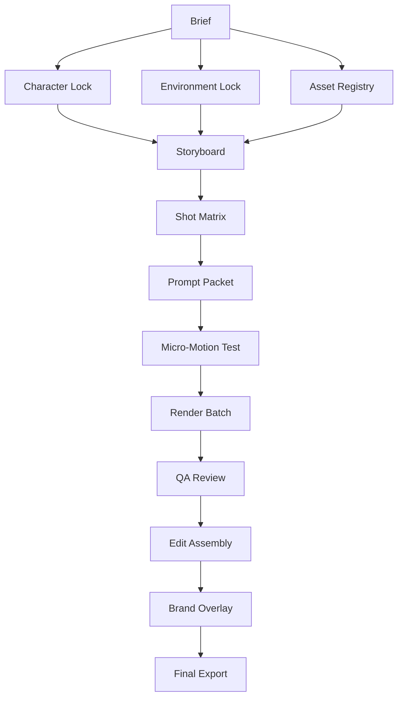

# Fina Calle OS Skill Dependency Map

## Enforcement Order

Every serious AI image/video/campaign production should follow this order:

1. Character Lock
2. Environment Lock
3. Asset Registry
4. Storyboard
5. Shot Matrix
6. Prompt Packet
7. Micro-Motion Test
8. Render Batch
9. QA Review
10. Edit Assembly
11. Brand Overlay
12. Final Export

## Dependency Direction

## Practical Dependencies

| If building... | Read first | Then read |
|---|---|---|
| Character packet | `CHARACTER_LIBRARY/CHARACTER_IDENTITY_LOCK_PROTOCOL.md` | `CHARACTER_LIBRARY/NEGATIVE_IDENTITY_PROTOCOL.md` |
| Cinematic shot set | `SKILLS/CINEMATIC_STUDIO/SKILL.md` | `PROMPTS/MASTER_AI_PROMPT_GRAMMAR.md`, `SHOT_MATRICES/SHOT_MATRIX_STARTER.md` |
| Colattao campaign | `SKILLS/COLATTAO_DIGITAL_EXPERIENCE/SKILL.md` | `HANDOFFS/ENCANTO_FINA_CALLE_DIGITAL_MENU_LAUNCH_HANDOFF.md` |
| Digital Menu work | `SKILLS/COLATTAO_DIGITAL_EXPERIENCE/SKILL.md` | `PROMPTS/FINA_CALLE_OS_PROMPT_RULES.md` |
| QA review | `SKILLS/CONSISTENCY_QA_ENGINE/SKILL.md` | `PROMPTS/PRE_RENDER_PACKET_TEMPLATE.md` |
| Campaign launch | `SKILLS/CAMPAIGN_LAUNCH_SYSTEM/SKILL.md` | `SHOT_MATRICES/SHOT_MATRIX_STARTER.md` |
| Client website | `SKILLS/WEB_STUDIO/SKILL.md` | `HANDOFFS/PREVIEW_PRODUCTION_REVIEW_WORKFLOW.md` |

## Rule Import Map

| Rule | Canonical Location | Used By |
|---|---|---|
| Character Identity Lock | `CHARACTER_LIBRARY/CHARACTER_IDENTITY_LOCK_PROTOCOL.md` | Character, Cinematic, Campaign, QA |
| Negative Identity | `CHARACTER_LIBRARY/NEGATIVE_IDENTITY_PROTOCOL.md` | Character, Cinematic, QA |
| One Motion Rule | `STORYBOARDS/ONE_MOTION_RULE.md` | Cinematic, Campaign, QA |
| Z-Axis Blocking Rule | `STORYBOARDS/Z_AXIS_BLOCKING_RULE.md` | Cinematic, QA |
| Master Prompt Grammar | `PROMPTS/MASTER_AI_PROMPT_GRAMMAR.md` | Cinematic, Campaign, QA |
| Model Selection | `PROMPTS/AI_MODEL_SELECTION_GUIDE.md` | Cinematic, Campaign |
| Pre-Render Packet | `PROMPTS/PRE_RENDER_PACKET_TEMPLATE.md` | Render planning, QA |
| No AI-generated logos | `PROMPTS/FINA_CALLE_OS_PROMPT_RULES.md` | All modules |
| Digital Menu terminology | `SKILLS/COLATTAO_DIGITAL_EXPERIENCE/SKILL.md` | Colattao, Web Studio, QA |
| Preview/production review | `HANDOFFS/PREVIEW_PRODUCTION_REVIEW_WORKFLOW.md` | Web Studio, Campaign, Colattao |
| Encanto launch handoff | `HANDOFFS/ENCANTO_FINA_CALLE_DIGITAL_MENU_LAUNCH_HANDOFF.md` | Colattao, Campaign |
| Consistency QA | `SKILLS/CONSISTENCY_QA_ENGINE/SKILL.md` | All AI production |
