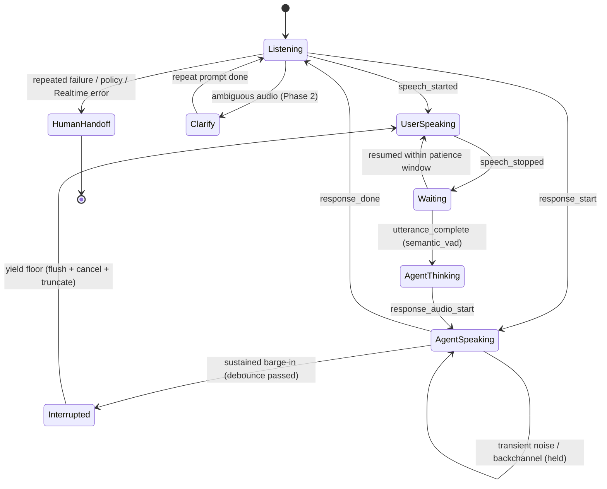

# SoundGate — engineering spec (voice gateway)

> **Scope.** This is the *implementation* spec for the turn-taking layer inside
> `services/voice-gateway`. The product/strategy doc — vision, tiers, sales framing — is
> canonical at `PRODUCT_MODULES/FINA_CALLE_SOUNDGATE_CONCEPT.md`; keep the two in sync,
> with this file owning code-level detail (state machine, KPI definitions, phase plan).

SoundGate is the **local, synchronous turn-taking referee** between Twilio audio and the
OpenAI Realtime brain. It runs in-process (never an LLM round-trip → no added latency) and
decides whose turn it is: keep talking, yield, wait, ignore noise, ask to repeat, escalate.

## Turn state machine
Separates the three things weaker systems conflate — **acoustic signal**, **floor
possession**, and **agent action** — which is what makes the agent sound less robotic.

## KPIs (what `/stats` emits today vs. what needs QA labeling)
Latency alone hides regressions; we measure **turn quality**. Shipped counters live in
`store.ts` and roll up per-tenant in `/stats`.

| KPI | Source | Status | Target |
|---|---|---|---|
| `ttfaAvgMs` / `ttfaP50Ms` | caller `speech_stopped` → first agent audio | **live** | P50 < 1000 ms |
| `bargeIns` | floor yielded to a sustained interruption | **live** | — (rate, with below) |
| `transientsSuppressed` | debounce HELD a blip / backchannel | **live** | the win for noisy venues |
| `realtimeErrors` (+ `lastErrorCode`) | OpenAI Realtime `error` (e.g. `insufficient_quota`) | **live** | → 0 |
| `hangupsAfterInterruption` | call ended ≤4 s after a barge-in | **live** | early-warning, → 0 |
| `speechStarts` | VAD `speech_started` count | **live** | denominator |
| **false barge-in rate** | barge-in caused by noise/non-directed speech | **needs QA labeling** | < 2% |
| **missed barge-in rate** | caller interrupted, agent didn't stop | **needs QA labeling** | < 2% |
| **WER / DER by cohort** | manual QA vs. system | **needs QA bench** | per-cohort baseline |

> `false`/`missed` barge-in and WER/DER can't be derived from server signals alone — they
> need a labeled QA bench (see cohort note). `transientsSuppressed` and
> `hangupsAfterInterruption` are the cheap on-line proxies we use until that exists.

## Phase plan (local-first; annotated against the agreed order)
1. **Docs — DONE.** This file + the concept doc.
2. **Telemetry — DONE (this PR).** The `/stats` counters above; keyless test in
   `simulate.ts` Scenario 11.
3. **Turn Manager.** The referee logic already lives in `soundgate.ts` (`BargeInGate`) +
   `realtime.ts` — *not* `server.ts` (which only flushes Twilio). Defer the full
   `TurnManager` extraction until it manages **>1 signal** (i.e. pair it with step 4) so we
   don't abstract around a single input. Keep the accepted **immediate/debounced
   barge-in baseline** (`soundGate.bargeInMinMs`).
4. **Advisory local VAD.** Add Silero/WebRTC as a **second opinion only**, never a hard
   gate — and only once KPIs show OpenAI's VAD actually misfiring (measure first; a local
   VAD adds a μ-law→PCM resample + sidecar). Telephony is 8 kHz μ-law mono, so set
   expectations accordingly.
5. **Local engine path.** Introduce the **seam** now-ish — `VOICE_ENGINE=openai|local` +
   a `VoiceEngine` adapter interface (portability, mirrors the booking-connector pattern).
   **Defer the actual local STT + Ollama + TTS realtime implementation** — it's a large,
   latency-sensitive build, explicitly "Plan B / later" in `AI_PHONE_ASSISTANT_PLAN.md`,
   and competes with the current active build (VBFH). The seam is cheap; the engine isn't.
6. **Account isolation.** Tenants are already capsules (`knowledge` pack + connector +
   voice + language + `soundGate`). Extend incrementally with a per-tenant `turnDetection`
   override (proposed),
   `allowedTools` + `policy` + per-tenant `testCalls` fixtures.

## Operational thresholds (starting heuristics — tune on real data)
| Signal | Initial value | Why |
|---|---:|---|
| Barge-in debounce (`bargeInMinMs`) | 150 ms (300 ms noisy venues) | hold through transients/backchannels |
| Server VAD threshold | 0.5 (raise in noise) | higher = fewer false speech triggers |
| End-of-turn silence (`server_vad`) | 500–600 ms | hysteresis so ideas aren't cut |
| Patience after `speech_stopped` | 600–1200 ms if fillers/incomplete | human floor-holding |
| Ask-repeat trigger | 2 consecutive ambiguous events | protect UX without over-interrupting |

## Constraints & decisions on record
- **8 kHz μ-law mono is a hard ceiling** on ambient intelligence. The real long-term
  unlock is a **wideband channel (OpenAI SIP / app / kiosk)**, not a better classifier on
  bad audio.
- **Cohort/bilingual testing is required.** Colattao is a Spanish-speaking business; the QA
  bench must include **es/en code-switching** and accented speech, not clean English. (Set
  that tenant's `language: "Spanish"`; the English-lock otherwise routes them to a message.)
- **Shipped default is tuned `server_vad`** (threshold 0.6 / 700 ms trailing silence — the
  barge-in direction the gateway settled on for noisy phone lines). `semantic_vad` (better
  "thought patience") is a **proposed** per-tenant `turnDetection` override, not yet wired —
  **A/B it against `server_vad`** once the false/missed barge-in KPIs exist.
- **Silero is NOT in the MVP** — measure first; OpenAI VAD + the debounce is the baseline.
- **Compliance unchanged:** inbound-only, AI disclosure on by default; outbound stays
  TCPA-gated (FCC treats AI voices as "artificial"); Virginia is one-party consent.
- **Realtime hard-errors** (e.g. `insufficient_quota`) are now *observed* in `/stats`. The
  recommended **fast-follow** is graceful in-call degradation: a brief spoken apology +
  `take_message` fallback so a quota blip becomes a captured lead, not a silent hang-up.
